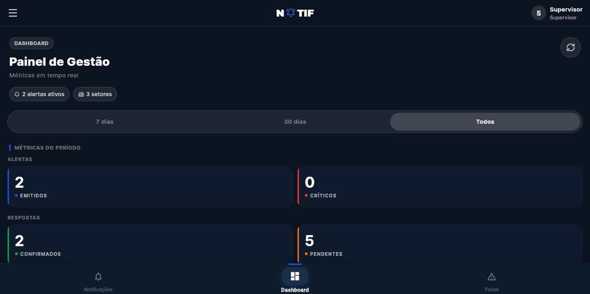
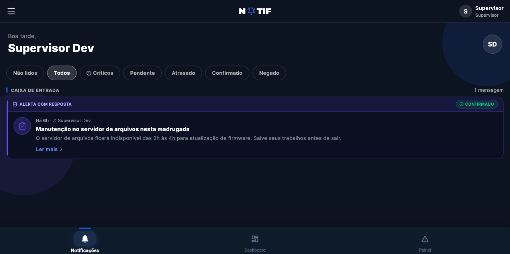
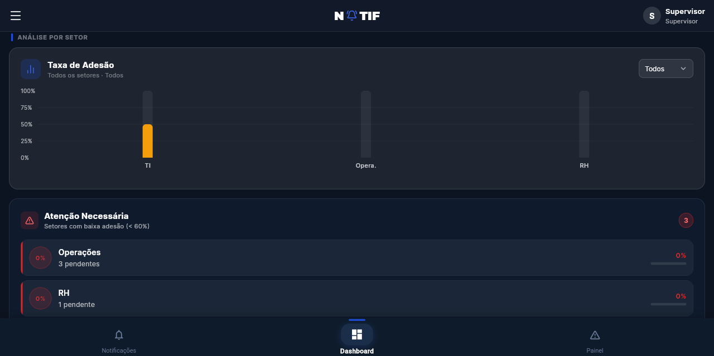

# NOTIF

**Plataforma corporativa de notificações com exposição obrigatória, confirmação de ciência e SLA por setor.**




---

## O que é

Avisos importantes morrem em mural, e-mail e grupo de mensagens. Quando o assunto é uma mudança de política, um procedimento de segurança ou uma instrução que precisa ser lida por todo mundo, "enviei" não é o mesmo que "souberam".

O NOTIF fecha essa lacuna: o aviso é exibido de forma bloqueante até o colaborador confirmar ciência, e cada confirmação (ou ausência dela) fica registrada com data, hora e tempo de resposta. O gestor acompanha em tempo real quem já confirmou, quem está pendente e quais setores estão abaixo da taxa esperada.

- **Supervisores e admin** criam avisos, segmentam por setor ou enviam para todos, definem criticidade e prazo.
- **Colaboradores** recebem, leem e confirmam — ou negam, quando não se aplica.
- **Gestão** acompanha métricas de adesão, pendências e atrasos por setor e por período.

## Funcionalidades

- Quatro níveis de criticidade (`LOW`, `MEDIUM`, `HIGH`, `CRITICAL`), com bloqueio da interface nos críticos
- Segmentação por setor ou distribuição global
- SLA configurável por notificação, com marcação automática de atraso (`OVERDUE`)
- Ciclo de vida auditável por destinatário: pendente, visto, confirmado, atrasado, negado
- Push notifications por Firebase Cloud Messaging (web)
- Dashboard com KPIs, taxa de adesão por setor e filtros de período
- Controle de acesso por papel: `EMPLOYEE`, `SUPERVISOR`, `ADMIN`
- Dados de exemplo prontos para desenvolvimento (setores, usuários e notificações em todos os estados)

## Stack

| Camada | Tecnologias |
|---|---|
| API | NestJS 11, Prisma 6, PostgreSQL, JWT (Passport), Swagger |
| Web | Flutter Web, Riverpod, go_router, fl_chart, Firebase Messaging |
| Banco | PostgreSQL (Supabase, com PgBouncer) |
| Push | Firebase Cloud Messaging |
| Deploy | Vercel (estático + função serverless da API) |

## Estrutura do repositório

```
apps/
├── api/            # Backend — NestJS + Prisma (ver apps/api/README.md)
│   └── prisma/     # schema, migrations e seed
└── web/            # Frontend — Flutter Web (ver apps/web/README.md)
docs/img/           # capturas usadas neste README
scripts/
├── dev.sh          # sobe API + app para desenvolvimento
└── preview.py      # serve o bundle de produção com /api proxiado para a API local
vercel.json         # roteamento do deploy
MANUAL_TECNICO.md   # arquitetura, modelo de dados e decisões
MANUAL_DO_USUARIO.md
```

## Rodando localmente

Pré-requisitos: Node 20+, Flutter 3.2+, um banco PostgreSQL (local ou Supabase) e, para push, um projeto Firebase.

```bash
git clone https://github.com/arthurRocha01/NOTIF.git
cd NOTIF
```

### 1. API

```bash
cd apps/api
npm ci
cp .env.example .env          # preencha as variáveis (tabela abaixo)
npx prisma migrate deploy     # cria o schema
npm run prisma:seed           # popula setores, usuários e notificações de exemplo
npm run start:dev             # http://localhost:5050/api
```

Swagger em http://localhost:5050/swagger.

### 2. App web

```bash
cd apps/web
flutter pub get
flutter run -d chrome         # ou flutter run -d web-server --web-port 8080
```

O app em desenvolvimento aponta para `http://localhost:5050/api`.

### Atalho

Os dois sobem juntos com um comando:

```bash
./scripts/dev.sh              # API + app, abrindo o navegador
./scripts/dev.sh --no-browser # API + app em http://localhost:8080
./scripts/dev.sh --api-only   # só a API
```

Para conferir o bundle de produção (o mesmo que vai ao ar) contra a API local:

```bash
cd apps/web && flutter build web && cd ../..
./scripts/preview.py          # http://localhost:8090, com /api proxiado
```

### Usuários criados pelo seed

Senha de todos: `password123`

| Papel | E-mail | Setor |
|---|---|---|
| ADMIN | admin.dev@notif.com | TI |
| SUPERVISOR | supervisor.dev@notif.com | TI |
| EMPLOYEE | employee.dev@notif.com | TI |
| SUPERVISOR | supervisor.ops@notif.com | Operações |
| EMPLOYEE | employee.ops@notif.com | Operações |
| EMPLOYEE | employee.ops2@notif.com | Operações |
| EMPLOYEE | employee.rh@notif.com | RH |

O seed também cria cinco notificações cobrindo os quatro níveis de criticidade e os cinco estados de uma obrigação, para o dashboard e as listas já terem dado.

## Variáveis de ambiente

| Variável | Para que serve | Obrigatória |
|---|---|---|
| `DATABASE_URL` | conexão da aplicação com o banco (pooler, porta 6543) | sim |
| `DIRECT_URL` | conexão direta usada pelo Prisma nas migrations | sim |
| `JWT_SECRET` | assinatura dos tokens de autenticação | sim |
| `JWT_EXPIRES_IN` | validade do token (ex.: `1d`) | sim |
| `FIREBASE_SERVICE_ACCOUNT` | credencial do Firebase Admin para push (JSON em uma linha) | para push |
| `GOOGLE_APPLICATION_CREDENTIALS` | alternativa ao anterior, apontando para o arquivo da service account | opcional |

O `apps/api/.env.example` traz todas com valores de exemplo — nenhuma credencial real é versionada.

## Testes

```bash
cd apps/api
npm run test        # unitários (Jest)
npm run test:e2e    # ponta a ponta
```

## Arquitetura

```
┌──────────────────────────────┐
│         Flutter Web          │  apps/web
│  Riverpod · go_router · FCM  │
└───────────────┬──────────────┘
                │ HTTPS /api/*
┌───────────────▼──────────────┐
│          API NestJS          │  apps/api
│   Prisma · JWT · Firebase    │
└───────────────┬──────────────┘
                │
┌───────────────▼──────────────┐
│    PostgreSQL (Supabase)     │
│   PgBouncer · connection pool│
└──────────────────────────────┘
```

Em produção, o bundle estático e a API vivem no mesmo domínio: `/api/*` é roteado para a função serverless e o restante é servido do `apps/web/build/web` (ver `vercel.json`).

O ciclo de vida de uma obrigação é o coração do sistema:

```
PENDING ──abertura──▶ VIEWED ──confirmação──▶ ACKNOWLEDGED
   │                    │
   │                    └──negativa──▶ DENIED
   └──prazo do SLA vencido──▶ OVERDUE
```

## Deploy

O deploy é feito na Vercel, com um projeto só:

1. Configure as variáveis de ambiente (as cinco da tabela) em Production e Preview.
2. Gere o bundle do front: `cd apps/web && flutter build web`. O conteúdo de `build/web` é versionado de propósito — é ele que a Vercel serve.
3. Deploy via Git (push em `main`) ou `vercel --prod`.

## Prints

| Caixa de entrada | Adesão por setor |
|---|---|
|  |  |

## Documentação

- [`MANUAL_TECNICO.md`](MANUAL_TECNICO.md) — arquitetura, modelo de dados, decisões e operação
- [`MANUAL_DO_USUARIO.md`](MANUAL_DO_USUARIO.md) — fluxo de uso por papel
- Swagger — documentação interativa da API na rota `/swagger`

## Licença

[MIT](LICENSE) — use, modifique e distribua, mantendo o aviso de copyright.
